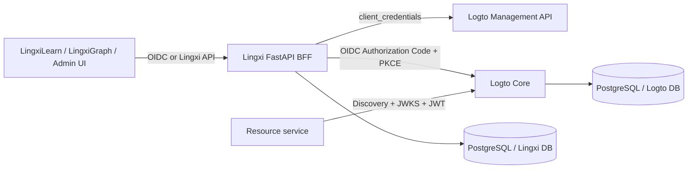

# Architecture

Logto is an external headless identity core. Lingxi owns the public abstraction, BFF session boundary, authorization policy exposed to callers and provider adapter. Lingxi never queries Logto tables directly.

The BFF is the only component allowed to use the Management API M2M secret. Resource services validate access tokens locally with OIDC Discovery and JWKS and do not call the Management API for each request.

## Tenant model

Logto Organization is the business tenant. An organization-scoped token must include `organization_id`; the SDK maps it to `Principal.tenant_id` and enforces path/claim equality in tenant-scoped BFF routes.

## Provider replacement boundary

`lingxi_identity.providers.logto` contains all Logto endpoint paths and field aliases. The rest of the SDK consumes `User`, `Role`, `Organization`, `AuditEvent`, `Page` and `Principal`. A Casdoor or ZITADEL adapter can implement the same resource methods without changing LingxiLearn or LingxiGraph.
